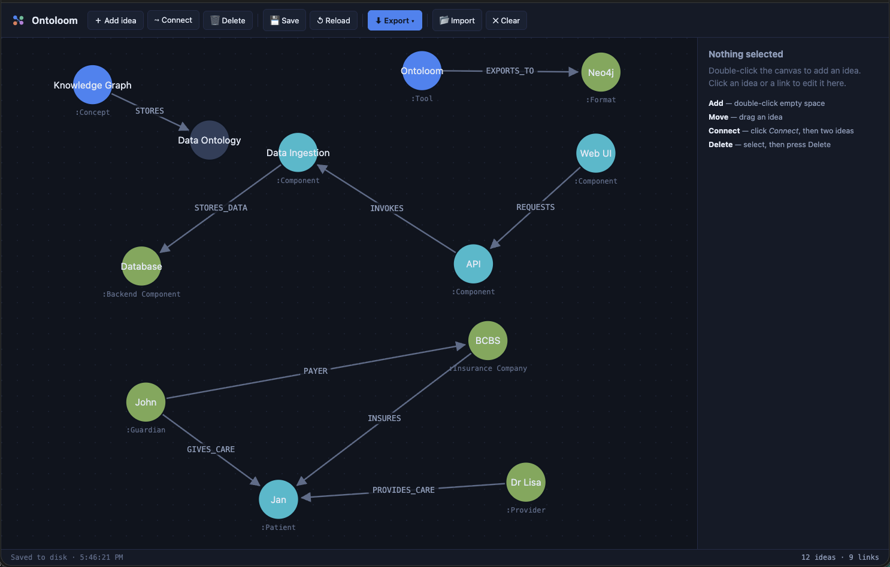

# Ontoloom

**A lightweight, airgapped ontology & knowledge-graph builder for people who think in ideas, not Cypher.**



Ontoloom is a single Rust binary with **zero external dependencies**. Run it and a visual graph editor opens in your browser. Draw out your ideas as nodes and links, then export them as Neo4j-ready **JSONL**, a runnable **Cypher** script, plain **JSON**, or **GraphML**, ready to load into Neo4j, Gephi, yEd, or back into Ontoloom.

It runs **entirely on your machine, on `127.0.0.1`, with no network access whatsoever.** No accounts, no cloud, no telemetry, nothing to fetch. Drop the binary on an airgapped box and it just works.

```
┌─────────────────────────────────────────────┐
│  ontoloom - airgapped ontology builder        │
└─────────────────────────────────────────────┘

  Editor:    http://127.0.0.1:7878/
  Data file: ./ontoloom-graph.json
```

## Demo

▶️ **[Watch a 3-minute walkthrough](https://github.com/jonathanpopham/ontoloom/releases/download/v0.1.0/ontoloom-demo.mp4)**: building an ontology from scratch and exporting it for Neo4j.

[](https://github.com/jonathanpopham/ontoloom/releases/download/v0.1.0/ontoloom-demo.mp4)

---

## Why

Knowledge graphs are a great way to organize ideas, but the tooling assumes you already speak a query language. Ontoloom is for the **domain expert, the researcher, the analyst** who has the ideas and the relationships in their head and just wants to lay them out visually and hand a clean file to an engineer (or to Neo4j directly).

Design constraints, on purpose:

- **No external dependencies.** The Rust side is `std` only: its own JSON codec, its own tiny HTTP server. Auditable in an afternoon.
- **Airgapped.** Binds to loopback, embeds its entire UI in the binary, never opens an outbound connection.
- **One file.** A ~450 KB binary. Copy it, run it, done.
- **Boring formats.** It exports the formats other tools already read, instead of inventing a new one.

## Get it

### Download a prebuilt binary (no toolchain needed)

Grab the single file for your OS from the [**Releases**](https://github.com/jonathanpopham/ontoloom/releases) page, then run it:

| OS | File | Run it |
|----|------|--------|
| **Windows** | `…-x86_64-pc-windows-msvc.zip` | Unzip, double-click `ontoloom.exe` |
| **macOS (Apple Silicon)** | `…-aarch64-apple-darwin.tar.gz` | Unpack, then `./ontoloom` |
| **macOS (Intel)** | `…-x86_64-apple-darwin.tar.gz` | Unpack, then `./ontoloom` |
| **Linux (any distro)** | `…-x86_64-unknown-linux-musl.tar.gz` | Unpack, `chmod +x ontoloom`, `./ontoloom` |

It's a single self-contained file; there is nothing to install. It opens your browser to the editor and runs entirely offline.

> **First-run security prompt:** because these binaries aren't code-signed, your OS may warn you the first time.
> - **macOS:** right-click the binary → **Open** (instead of double-clicking), or run `xattr -d com.apple.quarantine ./ontoloom` once.
> - **Windows:** on the "Windows protected your PC" dialog, click **More info → Run anyway**.
>
> This is expected for any unsigned open-source tool; the source is right here if you'd rather build it yourself.

### Build from source

You need a [Rust toolchain](https://rustup.rs/) (nothing else):

```bash
git clone https://github.com/jonathanpopham/ontoloom
cd ontoloom
cargo build --release
./target/release/ontoloom
```

Your browser opens to the editor automatically. That's it.

## Quick tutorial: your first ontology in 2 minutes

Let's model a tiny knowledge graph: **an author who wrote a book, published by a publisher.** Start Ontoloom (`./ontoloom`) and follow along in the browser tab that opens.

1. **Name it.** Click the title at the top left (it says *Untitled ontology*) and type `Library`. This name becomes your export file name later.

2. **Add the first idea.** Double-click anywhere on the dotted canvas. A circle appears and the panel on the right opens. In **Name**, type `Jane Austen`. In **Types / labels**, type `Author`. (Labels are how you group ideas; they become Neo4j labels on export.)

3. **Add two more.** Double-click two more empty spots and make:
   - `Pride and Prejudice` with label `Book`
   - `T. Egerton` with label `Publisher`

   Notice each label gets its own color, so kinds of ideas are easy to tell apart.

4. **Give one some detail.** Click the `Pride and Prejudice` circle, hit **+ Add property**, and add `year` → `1813`. Properties are the facts attached to an idea. (Type a number and it stays a number; type text and it stays text.)

5. **Connect them.** Click **⤳ Connect** in the toolbar (the canvas cursor turns to a crosshair). Click `Jane Austen`, then click `Pride and Prejudice`, and a link is drawn. Click the new link's label, and set its **relationship type** to `WROTE`. Then connect `T. Egerton` → `Pride and Prejudice` and type `PUBLISHED`. Press <kbd>Esc</kbd> to leave Connect mode.

6. **Tidy up.** Drag the circles around to arrange them. Scroll to zoom, drag the background to pan. Everything **autosaves** as you go.

7. **Export it.** Click **⬇ Export** and choose a format:
   - **Neo4j JSONL** or **Cypher** to load it straight into Neo4j
   - **Ontoloom JSON** to keep an editable copy (layout included)
   - **GraphML** for Gephi / yEd

   The file downloads as `Library.jsonl` (or `.cypher`, etc.), named from your title.

8. **Bring it back.** Click **📂 Import** and pick any file you just exported. It loads back into an editable graph with names, labels, relationship types, and properties intact. Anything Ontoloom exports, it can re-import.

That's the whole loop: **draw → export → hand to Neo4j (or re-import).** No query language required.

> **Loading into Neo4j:** for the Cypher file, paste its contents into the Neo4j Browser and run, or `cat Library.cypher | cypher-shell -u neo4j -p <password>`. For JSONL, use `CALL apoc.import.json("file:///Library.jsonl")`.

## Usage

```
ontoloom [OPTIONS]

OPTIONS:
    -p, --port <PORT>    Port to serve on (default: 7878)
    -d, --data <FILE>    Graph autosave file (default: ./ontoloom-graph.json)
        --no-open        Do not open a browser automatically
    -h, --help           Print help
    -V, --version        Print version
```

### Building a graph

| Action            | How                                                        |
|-------------------|-----------------------------------------------------------|
| **Add an idea**   | Double-click empty canvas (or the **＋ Add idea** button)  |
| **Name / type it**| Click it, edit in the panel. "Types" become Neo4j labels. |
| **Add properties**| Click it, **+ Add property** (key/value pairs)            |
| **Move**          | Drag it                                                    |
| **Connect**       | Click **⤳ Connect**, then click a source idea and a target |
| **Edit a link**   | Click the link's label, set its relationship type         |
| **Delete**        | Select, then press <kbd>Delete</kbd>                       |
| **Pan / zoom**    | Drag the background / scroll wheel                         |

Your work **autosaves** to disk and to the browser's local storage as you go, so a refresh (or a crash) never loses it.

## Export formats

Hit **⬇ Export** and pick one. Every format is generated in Rust, server-side.

### 1. Neo4j JSONL (`.jsonl`)
One JSON object per line, matching the shape Neo4j's APOC library reads. Import with:

```cypher
CALL apoc.import.json("file:///ontology.jsonl");
```

```json
{"type":"node","id":"n1","labels":["Person"],"properties":{"name":"Alice","age":30}}
{"type":"relationship","id":"r1","label":"KNOWS","start":{"id":"n1","labels":["Person"]},"end":{"id":"n2","labels":["Person"]},"properties":{"since":2020}}
```

### 2. Cypher script (`.cypher`)
A ready-to-run `CREATE` script. Paste it into the Neo4j Browser or pipe it to `cypher-shell`:

```cypher
CREATE (`n1`:Person {name: "Alice", age: 30})
CREATE (`n2`:Person {name: "Bob"})
CREATE (`n1`)-[:KNOWS {since: 2020}]->(`n2`)
;
```

```bash
cat ontology.cypher | cypher-shell -u neo4j -p password
```

### 3. Ontoloom JSON (`.json`)
A node-link document that round-trips back into Ontoloom via **📂 Import** (it also keeps your layout positions). Easy to consume from any language.

### 4. GraphML (`.graphml`)
Standard graph XML for **Gephi**, **yEd**, and `apoc.import.graphml`.

## Import: anything it exports, it reads back

Click **📂 Import** and pick a file. Ontoloom auto-detects the format from the
file name and contents, so **every format above round-trips**: JSON, JSONL,
Cypher, and GraphML all come back in as an editable graph. Node names, labels,
relationship types, and typed properties are preserved. Imports that carry no
layout (JSONL / Cypher / GraphML) are auto-arranged on a grid.

> The Cypher reader targets the `CREATE` shape Ontoloom emits and common simple
> variants; it is not a full Cypher query parser. JSON, JSONL, and GraphML
> imports are general.

## How it stays dependency-free

```
src/
  main.rs      CLI args, loopback bind, browser launch
  server.rs    a small HTTP/1.1 server on std::net (loopback only)
  json.rs      a hand-written JSON parser + serializer
  model.rs     the graph model + wire-format validation
  export.rs    the four exporters
  import.rs    the four importers + format auto-detection
  assets.rs    include_str! of the embedded web UI
web/
  index.html   the single-page editor shell
  app.js       vanilla-JS SVG graph editor (no frameworks)
  style.css
```

The frontend is embedded into the binary at compile time with `include_str!`, so the shipped executable has nothing to download. The backend speaks just enough HTTP/1.1 to serve those assets and a handful of JSON endpoints. `Cargo.toml` has an empty `[dependencies]` section, and that is the whole point.

## Testing

```bash
cargo test
```

Covers the JSON round-trip, graph validation (including rejecting links to non-existent nodes), and each exporter.

## License

MIT © Jonathan Popham. See [LICENSE](LICENSE).
